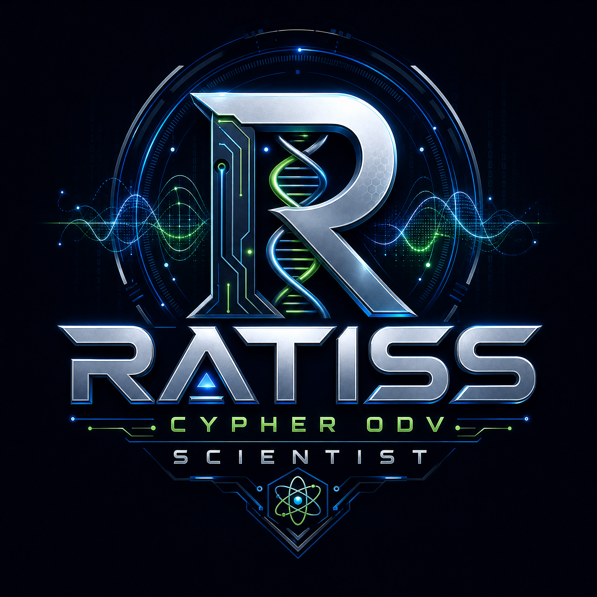
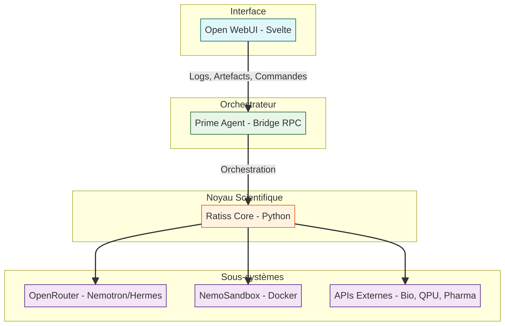

<p align="center">
  
</p>

# ⚛️ RATISS CYPHER ODV SCIENTIST — Noyau Scientifique Souverain

> **Ratiss Cypher ODV Scientist** est la version agentique et intégrée de RATISS V9 Aeon Prime.  
> Un laboratoire scientifique transdisciplinaire dans un fichier de 14 Mo — quantique, topologie, biologie, cryptographie, agentique.

---

## 🧠 Vision

RATISS est un **système scientifique souverain, frugal et certifié** qui tourne sur CPU, sans GPU, sans cloud, avec un Memory Guard strict à 7500 Mo.

Il orchestre :
- **Solveurs quantiques** (Lanczos ED, modèles t-J)
- **Topologie computationnelle** (homologie persistante GUDHI)
- **Preuves cryptographiques** (ZK-STARK RISC Zero)
- **Biologie structurale** (banque PDB locale)
- **Agents LLM** (Nemotron 3 Ultra, Hermes 3 405B via OpenRouter)
- **Sandbox Linux éphémère** (Docker)

**Identifiants :**
- ORCID : `0009-0000-4092-5313`
- DOI : `10.17605/OSF.IO/6JZMB`
- Portfolio : [https://github.com/evinajonathan13-max/Porte-folio-Jonathan-](https://github.com/evinajonathan13-max/Porte-folio-Jonathan-)

---

## 🏗️ Architecture



---

## 📦 Structure du Dépôt

```
ratiss-cypher-odv-scientist/
├── integrations/
│   └── prime-openwebui-bridge/
│       ├── server.ts                  # Pont RPC principal
│       ├── ratiss_runner.py           # Exécuteur du pipeline RATISS
│       ├── openrouter_orchestrator.py # Orchestrateur Nemotron/Hermes
│       ├── capabilities.py            # Définition des outils RATISS
│       ├── capability_runner.py       # Exécution des outils
│       ├── CONTRACT.md                # Contrat d'intégration
│       ├── RATISS_LOGIC_MAP.md        # Cartographie de la logique
│       └── .env.example               # Variables d'environnement
├── scripts/
│   └── run-ratiss-stack.sh            # Lancement de la stack
├── workspace/                         # Espace de travail (artefacts)
├── data/                              # Données locales (PDB, vault)
├── requirements.txt
├── Dockerfile
└── README.md
```

---

## 🚀 Installation et Lancement

### Prérequis
- Python 3.10+
- Docker (pour NemoSandbox)
- Node.js 18+ (pour Open WebUI)
- Clé API OpenRouter (optionnelle pour Nemotron/Hermes)

### Étapes

1. **Cloner le dépôt**
```bash
git clone https://github.com/evinajonathan13-max/ratiss-cypher-odv-scientist.git
cd ratiss-cypher-odv-scientist
```

2. **Configurer l'environnement**
```bash
cp integrations/prime-openwebui-bridge/.env.example integrations/prime-openwebui-bridge/.env
# Renseigner les variables (ne pas committer la clé)
```

3. **Lancer la stack**
```bash
./scripts/run-ratiss-stack.sh
```

4. **Accéder à l'interface**
- Open WebUI : http://127.0.0.1:3000
- Endpoint OpenAI local : http://127.0.0.1:8787/v1
- Console événements : http://127.0.0.1:8787/events
- Modèle à utiliser : prime-agent-ratiss

---

## ⚛️ Utilisation de RATISS

### 1. Lancement d'un pipeline scientifique
Dans l'interface Open WebUI, ou via l'API, soumettre une tâche comme :
`"Analyse la structure 4MZI avec RATISS, extrais les Betti, et génère une preuve ZK."`

### 2. Exemple de commande
```python
# Dans le REPL de Prime Agent
from ratiss_runner import run_ratiss_pipeline

result = run_ratiss_pipeline({
    "task": "Analyse la liaison p53/MDM2",
    "pdb_id": "4MZI",
    "domain": "structural_biology"
})
# Résultat : JSON + artefacts dans workspace/
```

### 3. Fichiers générés
Tous les artefacts sont sauvegardés dans `workspace/` :
- `result_{timestamp}.json`
- `zk_receipt_{timestamp}.b64`
- `report_{timestamp}.md`

---

## 🔐 Sécurité et Souveraineté

| Composant | Rôle |
| :--- | :--- |
| **Memory Guard** | Limite RAM à 7500 Mo, purge automatique à 7000 Mo. |
| **LocalAuthManager** | Authentification locale (PBKDF2+SHA256), zéro cloud. |
| **NemoSandbox** | Conteneur Docker éphémère (mem_limit=2g). |
| **Isolation** | Chaque utilisateur a son propre dossier workspace/users/{id}/. |
| **Chiffrement** | Traces de raisonnement chiffrées en .json.gz.enc. |

---

## 🧠 Modèles OpenRouter (optionnels)

Si `OPENROUTER_API_KEY` est configurée :
- **Planificateur** : `nvidia/nemotron-3-ultra-550b-a55b:free`
- **Exécuteur** : `nousresearch/hermes-3-llama-3.1-405b:free`

Les appels sont journalisés et les traces de raisonnement sont stockées.

---

## 📚 Dépendances

### Python
```bash
pip install chainlit requests docker psutil nemotron-think pm-copilot-engine bcrypt
```

### Node.js
```bash
npm install
```

---

## 🐳 Dockerfile (Hugging Face Spaces)
```dockerfile
FROM python:3.11-slim
RUN apt-get update && apt-get install -y docker.io curl && rm -rf /var/lib/apt/lists/*
WORKDIR /app
COPY requirements.txt .
RUN pip install --no-cache-dir -r requirements.txt
COPY . .
RUN mkdir -p /app/workspace /app/data
EXPOSE 7860
CMD ["chainlit", "run", "app.py", "--port", "7860", "--host", "0.0.0.0"]
```

---

## 🔧 Commandes Utiles

| Commande | Action |
| :--- | :--- |
| `./scripts/run-ratiss-stack.sh` | Lancer la stack complète |
| `python -m integrations.prime-openwebui-bridge.ratiss_runner --help` | Aide du runner |
| `chainlit run app.py` | Lancer l'interface seule |

---

## 📄 Licence
MIT — Open-source, souverain, libre.

---

## 🗣️ Contact
**Jonathan Evina**  
ORCID : `0009-0000-4092-5313`  
Email : `evinajonathan13@gmail.com`  
Portfolio : [https://github.com/evinajonathan13-max/Porte-folio-Jonathan-](https://github.com/evinajonathan13-max/Porte-folio-Jonathan-)

---

*"La physique n'est pas une limite. C'est une interface."*
